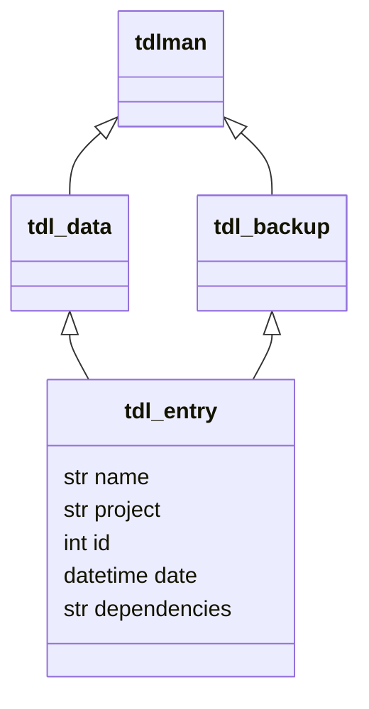

# tdl_manager
A simple python tool for managing To Do Lists
Updated 21/09/2022

## Future Additions:
 - Add priority to List items, then able to sort by priority
 - Add progress percentage/fraction - string entry

## Example diagram
